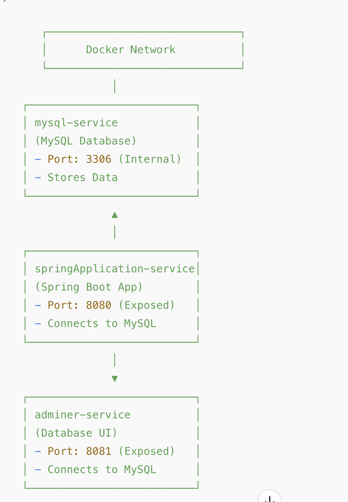

# 🐳 Spring Boot with MySQL & Adminer using Docker Compose

This project demonstrates how to containerize a **Spring Boot application** with **MySQL** and **Adminer** using **Docker Compose**.

> - Swagger Url: http://localhost:8080/swagger-ui/index.html#/
> - UI Url: http://localhost:8080/

## 📌 Project Structure

```
project-root/
├── src/main/java       # Java source code
├── src/main/resources  # Configuration files
├── Dockerfile          # Defines how to build the Spring Boot app image
├── docker-compose.yml  # Defines multi-container setup
├── README.md           # Project documentation
```

## 🧑‍💻 Technologies Used

- Spring Boot
- Spring Web
- Thymeleaf
- HTML/CSS/JavaScript

## 🔧 Services Overview

- **MySQL (****`mysql-service`****)**
    - Runs MySQL database on port **3306** (internal Docker network)
    - Stores data in a persistent volume
- **Spring Boot Application (****`springApplication-service`****)**
    - Connects to MySQL at `mysql-service:3306`
    - Exposes API on port **8080**
- **Adminer (****`adminer-service`****)**
    - Provides a web-based database UI
    - Runs on port **8081** (accessible from browser)

## 📡 Docker Network Diagram

***

***
## 🚀 Getting Started

### 1️⃣ Clone the Repository

```sh
git clone https://github.com/beneite/SpringBootBasics.git
cd SpringWithDocker
```

### 2️⃣ Build and Run Containers

```sh
docker compose --profile entireApp up --build
```
- `--profile entireApp` will spin up the tagged services with 'entireApp' only
- `-d` runs containers in detached mode
- `--build` forces a rebuild of the Spring Boot image
- The docker compose will also take care of building the docker file/image.
- The docker file used is a multistage where in stage 1st i am creating the .jar file using the same in 2nd stage to bring the application up.

### 3️⃣ Check Running Containers

```sh
docker ps
```

### 4️⃣ Access Services

- **Spring Boot API** → `http://localhost:8080`
- **Adminer UI** → `http://localhost:8081`
    - **System:** `MySQL`
    - **Server:** `mysql-service`
    - **Username:** `ashish`
    - **Password:** `ashish@123`
    - **database:** `userManagementDb`

### 5️⃣ Stop and Remove Containers

```sh
docker-compose --profile entireApp down
```

# **🔹 Explanation of `docker-compose.yml` File**

`docker-compose.yml` file defines **four services** and uses **Docker Compose profiles** to control which services start together.

---

## **🚀 Services Breakdown**

### **1️⃣ MySQL Service for `entireApp` Profile** (`mysql-service`)
```yaml
  mysql-service:
    image: mysql:latest
    environment:
      MYSQL_DATABASE: userManagementDb
      MYSQL_ROOT_PASSWORD: ashish@123
      MYSQL_USER: ashish
      MYSQL_PASSWORD: ashish@123
    volumes:
      - ./src/main/resources/dockerizedEntireApp/init-script:/docker-entrypoint-initdb.d
      - ./src/main/resources/dockerizedEntireApp/volumes/mysql_data:/var/lib/mysql
    profiles:
      - entireApp
```
🔹 **Purpose:**
- Runs a MySQL database **only when using the `entireApp` profile**.
- Stores database files in **a persistent volume** (`mysql_data`).
- Initializes the database using scripts from `init-script`.

🔹 **Why No `ports` Mapping?**
- The MySQL container **is not accessible from outside Docker** because there is **no port mapping** (`8082:3306`).
- It can be accessed **only by other services inside Docker** (like `springApplication-service`).

---

### **2️⃣ MySQL Service for `onlyDb` Profile** (`mysql-service-onlyDb`)
```yaml
  mysql-service-onlyDb:
    image: mysql:latest
    environment:
      MYSQL_DATABASE: userManagementDb
      MYSQL_ROOT_PASSWORD: ashish@123
      MYSQL_USER: ashish
      MYSQL_PASSWORD: ashish@123
    ports:
      - "8082:3306"
    volumes:
      - ./src/main/resources/dockerizedEntireApp/init-script:/docker-entrypoint-initdb.d
      - ./src/main/resources/dockerizedEntireApp/volumes/mysql_data:/var/lib/mysql
    profiles:
      - onlyDb
```
🔹 **Purpose:**
- Runs a separate MySQL instance when using the `onlyDb` profile.
- **Exposes port `8082:3306`** so you can connect to the database from outside Docker (e.g., via MySQL Workbench, a local application, etc.).

🔹 **Why a Separate Service?**
- **Docker Compose profiles do not support conditional port mappings.**
- This duplication allows **one version of MySQL to expose a port (`8082:3306`)** while the other does not.

---

### **3️⃣ Adminer Service** (`adminer-service`)
```yaml
  adminer-service:
    image: adminer
    ports:
      - "8081:8080"
    profiles:
      - onlyDb
      - entireApp
```
🔹 **Purpose:**
- Runs **Adminer**, a web-based database management tool (like phpMyAdmin).
- Accessible at `http://localhost:8081` in your browser.
- Included in **both profiles (`onlyDb` and `entireApp`)** so that it works in both modes.

---

### **4️⃣ Spring Boot Application** (`springApplication-service`)
```yaml
  springApplication-service:
    build: .
    image: userserviceimage:v1
    ports:
      - "8080:8080"
    environment:
      spring.datasource.url: "jdbc:mysql://mysql-service:3306/userManagementDb?useSSL=false&allowPublicKeyRetrieval=true"
    depends_on:
      - mysql-service
    profiles:
      - entireApp
```
🔹 **Purpose:**
- Runs a Spring Boot application.
- Accessible at `http://localhost:8080`.
- Connects to MySQL (`mysql-service`) using JDBC.

🔹 **Key Configuration:**
- **Depends on `mysql-service`**, meaning MySQL starts **before** Spring Boot.
- **Database URL:**
  ```plaintext
  jdbc:mysql://mysql-service:3306/userManagementDb
  ```
  This tells Spring Boot to connect to the MySQL service inside Docker.

---

## **🎯 How Profiles Work in This Setup**
### **1️⃣ Running Only the Database (`onlyDb` Profile)**
```sh
docker compose --profile onlyDb up
```
✔ Starts:  
✅ `mysql-service-onlyDb` (with `8082:3306` exposed).  
✅ `adminer-service`.  
❌ **Does NOT start Spring Boot** (`springApplication-service`).

### **2️⃣ Running the Full Application (`entireApp` Profile)**
```sh
docker compose --profile entireApp up
```
✔ Starts:  
✅ `mysql-service` (without exposing ports).  
✅ `adminer-service`.  
✅ `springApplication-service`.  
❌ **Does NOT start `mysql-service-onlyDb`** (no duplicate MySQL).

---

## **🔥 Why This Approach is Useful**
✔ **Avoids exposing MySQL publicly when not needed.**  
✔ **Allows local access (`8082:3306`) when using `onlyDb` profile.**  
✔ **Keeps `entireApp` profile isolated (Spring Boot can access MySQL internally).**

*